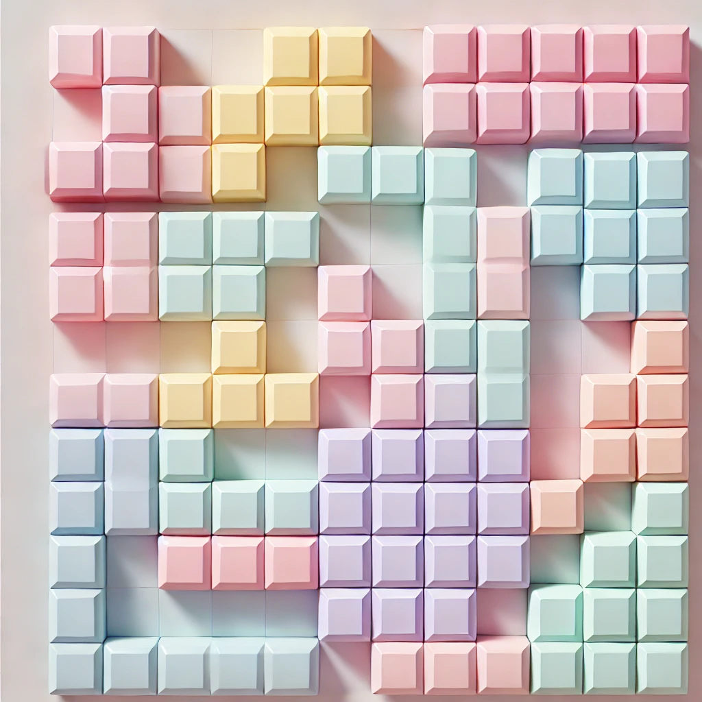

# Pastel Tetris

[Play Pastel Tetris on GitHub Pages]([(https://raimonvibe.github.io/Tetris2.0/])

## Description
Pastel Tetris is a simple and colorful implementation of the classic Tetris game. It features a soothing pastel color scheme and engaging sound effects, providing a fresh take on the timeless puzzle game.

## Features
- User login system
- Score tracking
- High score persistence
- Sound effects for game actions
- Responsive design
- Canvas-based game rendering
- Pastel color scheme

## Installation
To play Pastel Tetris, simply open the `index.html` file in a modern web browser. No additional installation or setup is required.

You can also play the game online by visiting the GitHub Pages link above.

## How to Play
1. Enter your username and click "Login"
2. Click "Start Game" to begin
3. Use the arrow keys to control the falling pieces:
   - Left Arrow: Move piece left
   - Right Arrow: Move piece right
   - Down Arrow: Move piece down faster
   - Up Arrow: Rotate piece

## Controls
- Left Arrow: Move piece left
- Right Arrow: Move piece right
- Down Arrow: Move piece down faster
- Up Arrow: Rotate piece clockwise

## License
This project is licensed under an open-source license. See the LICENSE.txt file for details.

Enjoy playing Pastel Tetris!
